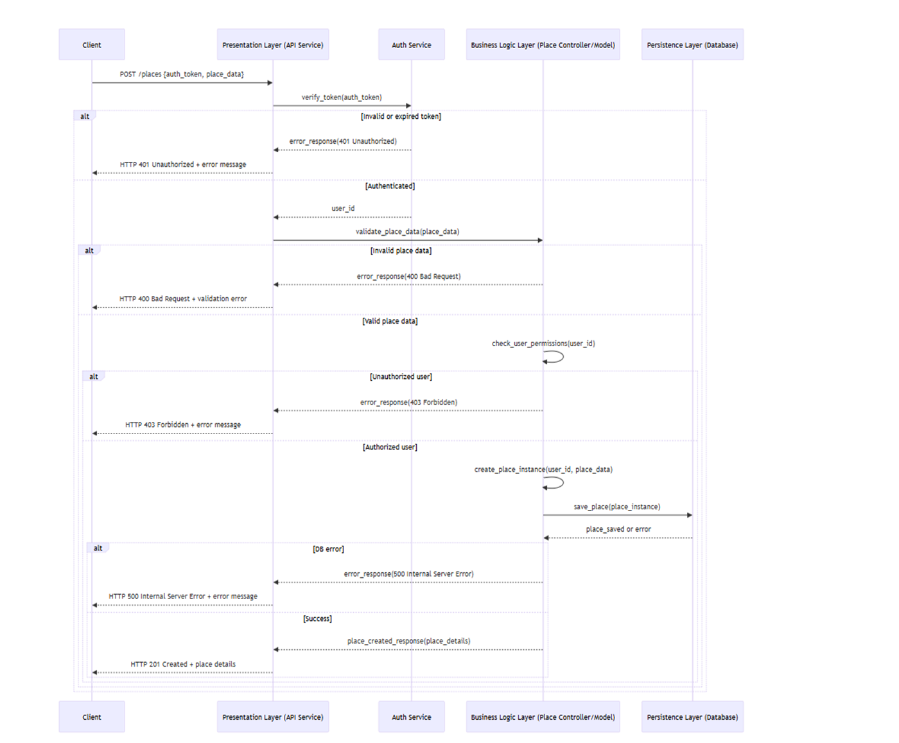

# HBnB Evolution - Airbnb Clone Project

---

## Objective

HBnB Evolution is an educational project that implements a simplified Airbnb-like platform to demonstrate:
- Modern web application architecture patterns
- Layered architecture implementation  
- Business logic modeling best practices
- API design and development
- Database-agnostic persistence layer design

---

## Key Functionalities

- **User Management**: Registration, profile updates, role-based access (users vs administrators)
- **Property Listings**: Create, update, manage listings with descriptions, pricing, and geolocation
- **Review System**: Rating and comment system for visited properties
- **Amenity Management**: Catalog system for property amenities with many-to-many relationships
- **Audit Trail**: Automatic creation/update timestamp tracking for all entities

---

## Package Diagram

### Three-Layer Architecture

#### Presentation Layer
- Provides the user interface and API contracts. It receives external requests, translates them into commands for the business layer, and returns formatted responses.

#### Business Logic Layer
- The core of the application. It enforces business rules, processes data, and coordinates tasks. It is independent of any specific user interface or database technology.

#### Persistence Layer
- Handles all data storage and retrieval. It translates application objects into database records and vice versa, insulating the business logic from database-specific details.

---

## Business Logic Diagram

### Class Responsibilities

**Base Class**  
- Attributes: uuid, created_at, updated_at  
- Methods: Inherited by all classes

**User**  
- Attributes: first_name, last_name, email, password, is_host  
- Methods: register, update, delete, list, list_all_places

**Review**  
- Attributes: owner_id, place_id, rating, comment  
- Methods: create, update, delete, list_review(s)

**Place**  
- Attributes: owner_id, title, description, price, latitude, longitude, list_of_amenities  
- Methods: create, update, delete, list_place(s), list_all_places

**Amenities**  
- Attributes: name, description  
- Methods: create, delete, list_amenity, list_all_amenities

---

## API Sequence Diagrams

### User Registration Flow

### Key Notes for User Registration Flow

### Sequence Summary

1. **Client → API Service**  
   `POST /users/register {username, email, password}`  

2. **Validation (API Service)**  
   - Invalid/missing fields → **400 Bad Request**  
   - Valid → continue  

3. **Check User (Business Logic → DB)**  
   - Exists → **409 Conflict (User/email exists)**  
   - Not exists → continue  

4. **Create User (Business Logic)**  
   - Hash password  
   - Create user instance  
   - Save to DB  

5. **Save Result (DB)**  
   - Error → **500 Internal Server Error**  
   - Success → **201 Created + user details**  

### Code Legend
- **400** → Bad input  
- **409** → Duplicate user  
- **500** → DB error  
- **201** → User created  
- Password is always **hashed** before saving

### Place Creation Flow

## Keynotes For Place Creation Flow

### Client Request
- The client sends a `POST /places` request with authentication token and place data.

### Authentication
- Token is verified by the **Auth Service**.
- If invalid/expired → **401 Unauthorized**.

### Validation
- Place data is checked.
- If invalid → **400 Bad Request**.

### Authorization
- User permissions are checked.
- If unauthorized → **403 Forbidden**.

### Place Creation
- A new place instance is created and sent to the database.
- If database error → **500 Internal Server Error**.

### Response
- On success, return **201 Created** with place details.

### Review Submission Flow

### Key Notes for Review Submission Flow 

- **Validation**  
  - Checks if both **User** and **Place** exist before creating a review.  
  - If either is missing → returns **404 Not Found**.

- **Input Checking**  
  - Validates `rating` and `comment` fields.  
  - If invalid → returns **400 Bad Request**.

- **Review Creation**  
  - If user/place exist and inputs are valid → a new review instance is created.

- **Persistence Layer**  
  - Saves the review into the database.  
  - If a database error occurs → returns **500 Internal Server Error**.

- **Response**  
  - On success → returns **201 Created** with the review details.

### Fetching Places Flow

### Key Notes for Fetching Places Flow

- **Input Validation First:**  
  The API validates filters before querying the database.

- **Error Handling:**  
  Distinguishes clearly between client errors (`400`) and server errors (`500`).

- **Multiple Outcomes:**  
  - Invalid request → `400 Bad Request`  
  - Valid but no data → `200 OK` with empty list  
  - Database error → `500 Internal Server Error`  
  - Success with data → `200 OK` with results

- **Layered Responsibility:**  
  - **Presentation Layer:** Handles validation, formatting, and error messages.  
  - **Business Logic Layer:** Manages core processing and orchestration.  
  - **Persistence Layer:** Performs raw data retrieval and storage.
---

## License

This project is for educational purposes only and is part of the **Holberton School** / **Foundations of Computer Science** curriculum.

---

## Authors

  <strong>Alba Eftimi</strong> &nbsp;&nbsp;&nbsp;&nbsp;&nbsp;&nbsp;&nbsp;&nbsp;&nbsp;&nbsp;&nbsp;&nbsp;&nbsp;&nbsp;&nbsp;&nbsp;&nbsp;&nbsp;&nbsp;&nbsp;&nbsp;&nbsp;&nbsp;&nbsp;&nbsp;&nbsp;&nbsp;
  <strong>Sokol Gjeka</strong> &nbsp;&nbsp;&nbsp;&nbsp;&nbsp;&nbsp;&nbsp;&nbsp;&nbsp;&nbsp;&nbsp;&nbsp;&nbsp;&nbsp;&nbsp;&nbsp;&nbsp;&nbsp;&nbsp;&nbsp;&nbsp;&nbsp;&nbsp;
  <strong>Renis Vukaj</strong> &nbsp;&nbsp;&nbsp;&nbsp;&nbsp;&nbsp;&nbsp;&nbsp;&nbsp;&nbsp;&nbsp;&nbsp;&nbsp;&nbsp;&nbsp;&nbsp;&nbsp;&nbsp;&nbsp;&nbsp;&nbsp;&nbsp;&nbsp;
  <strong>Kevin Voka</strong>

  GitHub: <a href="https://github.com/abfabs">abfabs</a> &nbsp;&nbsp;&nbsp;&nbsp;&nbsp;&nbsp;&nbsp;&nbsp;&nbsp;&nbsp;&nbsp;&nbsp;&nbsp;&nbsp;&nbsp;&nbsp;&nbsp;&nbsp;&nbsp;&nbsp;&nbsp;
  GitHub: <a href="https://github.com/sokolgj19">sokolgj19</a> &nbsp;&nbsp;&nbsp;&nbsp;&nbsp;&nbsp;&nbsp;&nbsp;&nbsp;&nbsp;&nbsp;&nbsp;&nbsp;
  GitHub: <a href="https://github.com/renisv">renisv</a> &nbsp;&nbsp;&nbsp;&nbsp;&nbsp;&nbsp;&nbsp;&nbsp;&nbsp;&nbsp;&nbsp;&nbsp;&nbsp;&nbsp;&nbsp;&nbsp;&nbsp;&nbsp;&nbsp;&nbsp;
  GitHub: <a href="https://github.com/kevin10v">kevin10v</a>

  <em>September 2025</em> 
  <em>Tirana, Albania</em>

