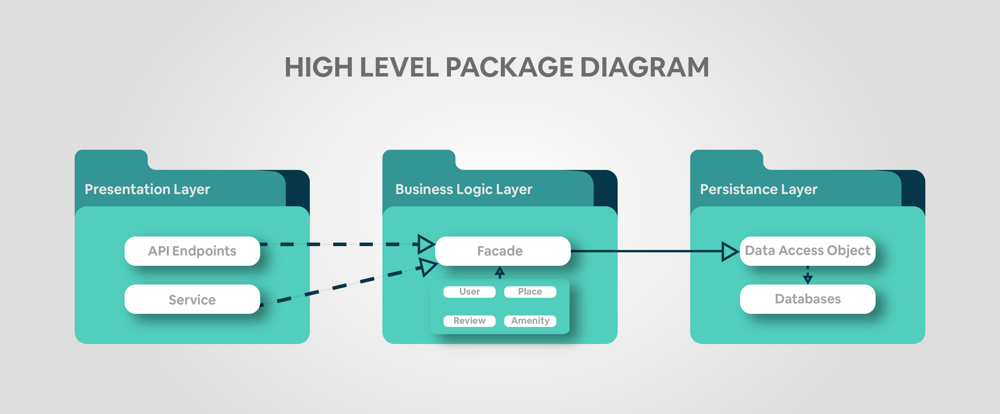
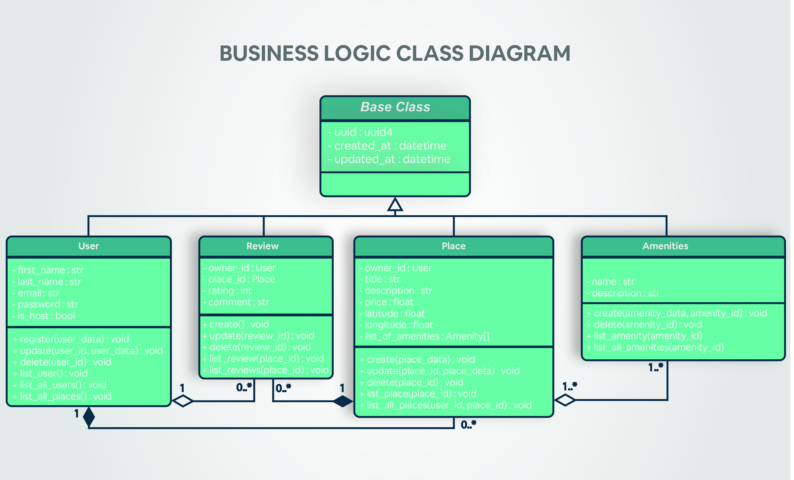

# HBnB Evolution - Airbnb Clone Project

---

## Objective

HBnB Evolution is an educational project that implements a simplified Airbnb-like platform to demonstrate:
- Modern web application architecture patterns
- Layered architecture implementation  
- Business logic modeling best practices
- API design and development
- Database-agnostic persistence layer design

---

## Key Functionalities

- **User Management**: Registration, profile updates, role-based access (users vs administrators)
- **Property Listings**: Create, update, manage listings with descriptions, pricing, and geolocation
- **Review System**: Rating and comment system for visited properties
- **Amenity Management**: Catalog system for property amenities with many-to-many relationships
- **Audit Trail**: Automatic creation/update timestamp tracking for all entities

---

## Package Diagram

### Three-Layer Architecture

#### Presentation Layer
- Provides the user interface and API contracts. It receives external requests, translates them into commands for the business layer, and returns formatted responses.

#### Business Logic Layer
- The core of the application. It enforces business rules, processes data, and coordinates tasks. It is independent of any specific user interface or database technology.

#### Persistence Layer
- Handles all data storage and retrieval. It translates application objects into database records and vice versa, insulating the business logic from database-specific details.

---

## Business Logic Diagram

### Class Responsibilities

**Base Class**  
- Attributes: uuid, created_at, updated_at  
- Methods: Inherited by all classes

**User**  
- Attributes: first_name, last_name, email, password, is_host  
- Methods: register, update, delete, list, list_all_places

**Review**  
- Attributes: owner_id, place_id, rating, comment  
- Methods: create, update, delete, list_review(s)

**Place**  
- Attributes: owner_id, title, description, price, latitude, longitude, list_of_amenities  
- Methods: create, update, delete, list_place(s), list_all_places

**Amenities**  
- Attributes: name, description  
- Methods: create, delete, list_amenity, list_all_amenities

---

## API Sequence Diagrams

### User Registration Flow

### Place Creation Flow

### Review Submission Flow

### Fetching Places Flow

---

## License

This project is for educational purposes only and is part of the **Holberton School** / **Foundations of Computer Science** curriculum.

---

## Authors

  <strong>Alba Eftimi</strong> &nbsp;&nbsp;&nbsp;&nbsp;&nbsp;&nbsp;&nbsp;&nbsp;&nbsp;&nbsp;&nbsp;&nbsp;&nbsp;&nbsp;&nbsp;&nbsp;&nbsp;&nbsp;&nbsp;&nbsp;&nbsp;&nbsp;&nbsp;&nbsp;&nbsp;&nbsp;&nbsp;
  <strong>Sokol Gjeka</strong> &nbsp;&nbsp;&nbsp;&nbsp;&nbsp;&nbsp;&nbsp;&nbsp;&nbsp;&nbsp;&nbsp;&nbsp;&nbsp;&nbsp;&nbsp;&nbsp;&nbsp;&nbsp;&nbsp;&nbsp;&nbsp;&nbsp;&nbsp;
  <strong>Renis Vukaj</strong> &nbsp;&nbsp;&nbsp;&nbsp;&nbsp;&nbsp;&nbsp;&nbsp;&nbsp;&nbsp;&nbsp;&nbsp;&nbsp;&nbsp;&nbsp;&nbsp;&nbsp;&nbsp;&nbsp;&nbsp;&nbsp;&nbsp;&nbsp;
  <strong>Kevin Voka</strong>

  GitHub: <a href="https://github.com/abfabs">abfabs</a> &nbsp;&nbsp;&nbsp;&nbsp;&nbsp;&nbsp;&nbsp;&nbsp;&nbsp;&nbsp;&nbsp;&nbsp;
  GitHub: <a href="https://github.com/sokolgj19">sokolgj19</a> &nbsp;&nbsp;&nbsp;&nbsp;&nbsp;&nbsp;&nbsp;&nbsp;&nbsp;&nbsp;&nbsp;&nbsp;
  GitHub: <a href="https://github.com/renisv">renisv</a> &nbsp;&nbsp;&nbsp;&nbsp;&nbsp;&nbsp;&nbsp;&nbsp;&nbsp;&nbsp;&nbsp;&nbsp;
  GitHub: <a href="https://github.com/kevin10v">kevin10v</a>

  <em>September 2025</em> 
  <em>Tirana, Albania</em>

