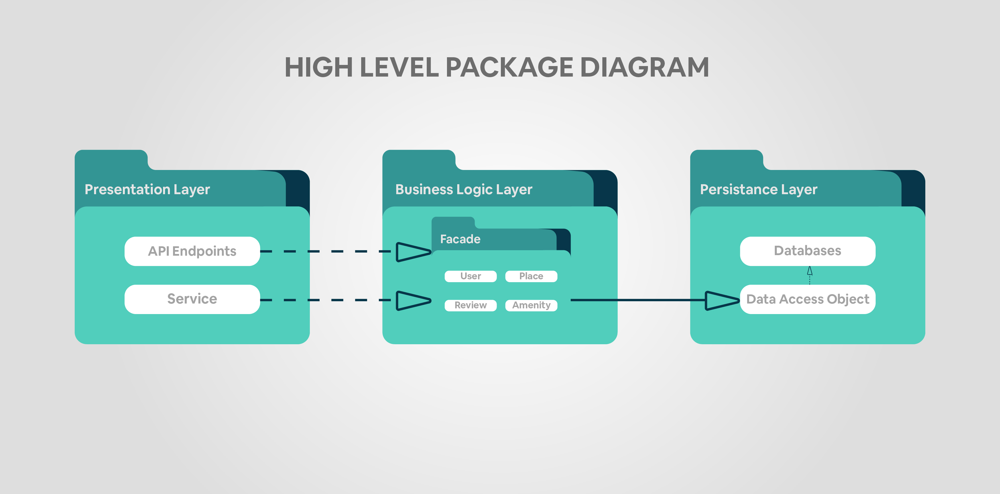

# HBnB Evolution - Airbnb Clone Project

---

## Objective
HBnB Evolution is an educational project that implements a simplified Airbnb-like platform to demonstrate:
- Modern web application architecture patterns
- Layered architecture implementation  
- Business logic modeling best practices
- API design and development
- Database-agnostic persistence layer design

---

## Key Functionalities
- **User Management**: Registration, profile updates, role-based access (users vs administrators)
- **Property Listings**: Create, update, manage listings with descriptions, pricing, and geolocation
- **Review System**: Rating and comment system for visited properties
- **Amenity Management**: Catalog system for property amenities with many-to-many relationships
- **Audit Trail**: Automatic creation/update timestamp tracking for all entities

---

## Technology Stack
- **Backend**: Python
- **Architecture**: 3-Layer Pattern
- **API**: RESTful Design
- **Identification**: UUID-based entity tracking
- **Database**: Database-agnostic design

---

## Project Status
**Phase 1**: Technical Documentation (Current)
-  High-Level Package Diagram ✅
-  Detailed Class Diagram for Business Logic Layer
-  Sequence Diagrams for API Calls
-  Documentation Compilation

---

## Design Architecture

### Package Diagram

---

## License

This project is for educational purposes only and is part of the **Holberton School** / *Foundations of Computer Science* curriculum.

---

## Authors

  <strong>Alba Eftimi</strong> &nbsp;&nbsp;&nbsp;&nbsp;&nbsp;&nbsp;&nbsp;&nbsp;&nbsp;&nbsp;&nbsp;&nbsp;&nbsp;&nbsp;&nbsp;&nbsp;&nbsp;&nbsp;&nbsp;&nbsp;
  <strong>Sokol Gjeka</strong> &nbsp;&nbsp;&nbsp;&nbsp;&nbsp;&nbsp;&nbsp;&nbsp;&nbsp;&nbsp;&nbsp;&nbsp;&nbsp;&nbsp;&nbsp;&nbsp;&nbsp;&nbsp;&nbsp;&nbsp;
  <strong>Renis Vukaj</strong> &nbsp;&nbsp;&nbsp;&nbsp;&nbsp;&nbsp;&nbsp;&nbsp;&nbsp;&nbsp;&nbsp;&nbsp;&nbsp;&nbsp;&nbsp;&nbsp;&nbsp;&nbsp;&nbsp;&nbsp;
  <strong>Kevin Voka</strong>

  GitHub: <a href="https://github.com/abfabs">abfabs</a> &nbsp;&nbsp;&nbsp;&nbsp;&nbsp;&nbsp;&nbsp;&nbsp;&nbsp;&nbsp;&nbsp;&nbsp;&nbsp;
  GitHub: <a href="https://github.com/sokolgj19">sokolgj19</a> &nbsp;&nbsp;&nbsp;&nbsp;&nbsp;&nbsp;&nbsp;&nbsp;&nbsp;&nbsp;&nbsp;&nbsp;&nbsp;
  GitHub: <a href="https://github.com/renisv">renisv</a> &nbsp;&nbsp;&nbsp;&nbsp;&nbsp;&nbsp;&nbsp;&nbsp;&nbsp;&nbsp;&nbsp;&nbsp;&nbsp;
  GitHub: <a href="https://github.com/kevin10v">kevin10v</a>

---

  <em>September 2025</em> 
  <em>Tirana, Albania</em>

